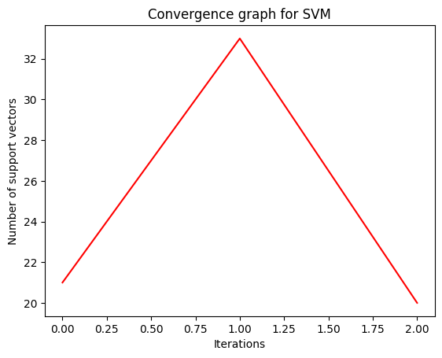

# ParameterOptimisation_SVM

Sample 1: Accuracy = 1.0
Best parameters:  {'break_ties': False, 'cache_size': 200, 'class_weight': None, 'coef0': 0.0, 'decision_function_shape': 'ovr', 'degree': 3, 'gamma': 'scale', 'kernel': 'rbf', 'max_iter': 1000, 'nu': 0.5, 'probability': False, 'random_state': None, 'shrinking': True, 'tol': 0.001, 'verbose': False}
--------------------------------------------------------------------------------
Sample 2: Accuracy = 0.9333333333333333
Best parameters:  {'break_ties': False, 'cache_size': 200, 'class_weight': None, 'coef0': 0.0, 'decision_function_shape': 'ovr', 'degree': 3, 'gamma': 'scale', 'kernel': 'rbf', 'max_iter': 1000, 'nu': 0.5, 'probability': False, 'random_state': None, 'shrinking': True, 'tol': 0.001, 'verbose': False}
--------------------------------------------------------------------------------
Sample 3: Accuracy = 0.9777777777777777
Best parameters:  {'break_ties': False, 'cache_size': 200, 'class_weight': None, 'coef0': 0.0, 'decision_function_shape': 'ovr', 'degree': 3, 'gamma': 'scale', 'kernel': 'rbf', 'max_iter': 1000, 'nu': 0.5, 'probability': False, 'random_state': None, 'shrinking': True, 'tol': 0.001, 'verbose': False}
--------------------------------------------------------------------------------
Sample 4: Accuracy = 0.9333333333333333
Best parameters:  {'break_ties': False, 'cache_size': 200, 'class_weight': None, 'coef0': 0.0, 'decision_function_shape': 'ovr', 'degree': 3, 'gamma': 'scale', 'kernel': 'rbf', 'max_iter': 1000, 'nu': 0.5, 'probability': False, 'random_state': None, 'shrinking': True, 'tol': 0.001, 'verbose': False}
--------------------------------------------------------------------------------
Sample 5: Accuracy = 0.9333333333333333
Best parameters:  {'break_ties': False, 'cache_size': 200, 'class_weight': None, 'coef0': 0.0, 'decision_function_shape': 'ovr', 'degree': 3, 'gamma': 'scale', 'kernel': 'rbf', 'max_iter': 1000, 'nu': 0.5, 'probability': False, 'random_state': None, 'shrinking': True, 'tol': 0.001, 'verbose': False}
--------------------------------------------------------------------------------
Sample 6: Accuracy = 0.9555555555555556
Best parameters:  {'break_ties': False, 'cache_size': 200, 'class_weight': None, 'coef0': 0.0, 'decision_function_shape': 'ovr', 'degree': 3, 'gamma': 'scale', 'kernel': 'rbf', 'max_iter': 1000, 'nu': 0.5, 'probability': False, 'random_state': None, 'shrinking': True, 'tol': 0.001, 'verbose': False}
--------------------------------------------------------------------------------
Sample 7: Accuracy = 0.9333333333333333
Best parameters:  {'break_ties': False, 'cache_size': 200, 'class_weight': None, 'coef0': 0.0, 'decision_function_shape': 'ovr', 'degree': 3, 'gamma': 'scale', 'kernel': 'rbf', 'max_iter': 1000, 'nu': 0.5, 'probability': False, 'random_state': None, 'shrinking': True, 'tol': 0.001, 'verbose': False}
--------------------------------------------------------------------------------
Sample 8: Accuracy = 0.9333333333333333
Best parameters:  {'break_ties': False, 'cache_size': 200, 'class_weight': None, 'coef0': 0.0, 'decision_function_shape': 'ovr', 'degree': 3, 'gamma': 'scale', 'kernel': 'rbf', 'max_iter': 1000, 'nu': 0.5, 'probability': False, 'random_state': None, 'shrinking': True, 'tol': 0.001, 'verbose': False}
--------------------------------------------------------------------------------
Sample 9: Accuracy = 0.9555555555555556
Best parameters:  {'break_ties': False, 'cache_size': 200, 'class_weight': None, 'coef0': 0.0, 'decision_function_shape': 'ovr', 'degree': 3, 'gamma': 'scale', 'kernel': 'rbf', 'max_iter': 1000, 'nu': 0.5, 'probability': False, 'random_state': None, 'shrinking': True, 'tol': 0.001, 'verbose': False}
--------------------------------------------------------------------------------
Sample 10: Accuracy = 0.9555555555555556
Best parameters:  {'break_ties': False, 'cache_size': 200, 'class_weight': None, 'coef0': 0.0, 'decision_function_shape': 'ovr', 'degree': 3, 'gamma': 'scale', 'kernel': 'rbf', 'max_iter': 1000, 'nu': 0.5, 'probability': False, 'random_state': None, 'shrinking': True, 'tol': 0.001, 'verbose': False}
--------------------------------------------------------------------------------

